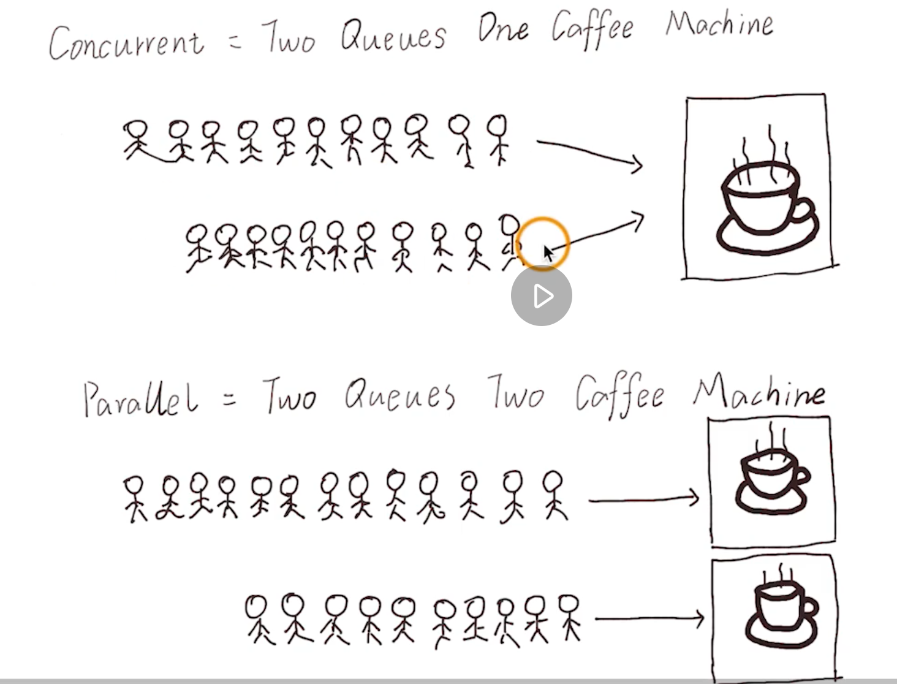
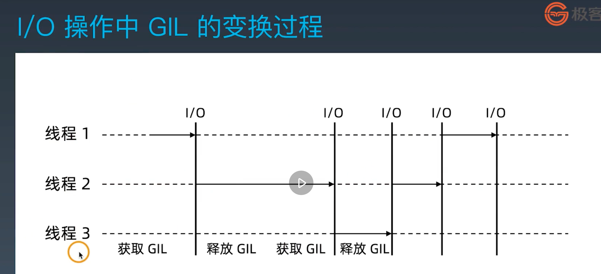

# Python进阶训练营学习笔记
---
## 第三周：scrapy框架深度解析
### **本周内容一览：**
#### 1. Scrapy 并发参数优化原理：
* scrapy 的异步设置：
  
* 同步请求和异步请求的概念：
  同步请求：如，requests请求，需要等待请求返回才进行下一次的请求；
  异步请求：如，scrapy，一个请求没返回也可以执行下一个请求。
* twisted是异步编程模型，任务之间互相独立：
  
* 课程中的twisted_demo例子：
  
      from twisted.internet import defer
      from twisted.internet import reactor
      from twisted.web.client import getPage
      def response(*args, **kwargs):
        print('返回网页内容：')
        print(args, kwargs)
      def callback(*args):
        print('执行一个回调。')
      @defer.inlineCallbacks
      def start(url):
        d = getPage(url.encode('utf-8'))
        d.addCallback(response)
        d.addCallback(callback)
        yield d
      def stop(*args, **kwargs):
        reactor.stop()
  可以简单理解为，把所需的任务列队，然后丢给reactor：

      urls = ['http://www.baidu.com','http://www.sougou.com']
      li = []
      for url in urls:
        ret = start(url) #实现@defer.inlineCallbacks的start()
        li.append(ret)
      print(li)
      d = defer.DeferredList(li)
      d.addBoth(stop) #实现@defer.inlineCallbacks的stop()
      reactor.run()
* 课程参考资料：   
>1. 获取课程源码操作方法：
切换分支：git checkout 3c
>2. Twisted 学习参考文档：
https://pypi.org/project/Twisted/
>3. asyncio — 异步 I/O 学习文档
https://docs.python.org/zh-cn/3.7/library/asyncio.html

#### 2. 多进程：进程的创建
* 概念：
  单任务、多任务、同步、异步、多进程、父进程、子进程
  函数也是对象，具体说来是可调用对象，函数名+()表示调用函数
* 进程调用的两种形式：  
  1. os.fork():了解底层运作；
  2. multiprocessing.Process : 高级封装。
* os.fork()的返回值：
  fork()运行时，会有2种返回值，返回值为大于0时，此进程为父进程，且返回的数字为子进程的PID；当返回值为0时，此进程为子进程。

        res = os.fork()
        print(f'res == {res}')
        if res == 0:
          print(f'我是子进程,我的pid是:{os.getpid()}我的父进程id是:{os.getppid()}')
        else:
          print(f'我是父进程,我的pid是: {os.getpid()}')
      <运行结果>
      res == 2044
      我是父进程,我的pid是: 1963
      res == 0
      我是子进程,我的pid是:2044我的父进程id是:1963
* 注意Process的args参数：
  
      if __name__ == '__main__':
        p = Process(target=f, args=('Yann',))  #args的格式是元组，kwargs的格式是字典。
        p.start()
        p.join(timeout=3)  #主进程等待子进程结束才自己接着往下运行，注意join()放置的位置！
* join()的作用：主进程等待子进程结束才自己接着往下运行，注意join()放置的位置！
* 课程参考资料：
>1. 获取课程源码操作方法：
切换分支：git checkout 3c
>2. os 模块学习文档：
https://docs.python.org/zh-cn/3.7/tutorial/stdlib.html#operating-system-interface
>3. multiprocessing – 基于进程的并行学习文档： https://docs.python.org/zh-cn/3.7/library/multiprocessing.html 

#### 3. 多进程：多进程程序调试技巧
* python文件的运行方式：
  
      #文件：test.py
      def test():
        print('In test()')
        print(__name__)
      print(__name__)
  1. 单独运行：
     命令：python test.py

          __name__ : __main__
  2. 作为模块运行：
     命令：python -m test.py 或 被引入：import test

          __name__ : test
* 程序创建进程的最佳数量：
  先获得系统的核心数：multiprocessing.cpu_count()   
  因为一个进程占用了一个核心，所进程数量不要超过核心数，最佳为核心数量。    
* 获取当前活动的子进程： multiprocessing.active_children()
* 创建进程的两个方法：
  1. 创建Process（）对象，通过target传递函数方法；
  2. 继承Process类，实现run（）方法。
* 课程参考资料：
>1. 获取课程源码操作方法：
切换分支：git checkout 3c

#### 4. 多进程：使用队列实现进程间的通信
* 队列Queue:
  1. get:  'Queue.get(block=True, timeout=None)'  
   从队列中取出并返回对象。如果可选参数 block 是 True (默认值) 而且 timeout 是 None (默认值), 将会阻塞当前进程，直到队列中出现可用的对象。如果 timeout 是正数，将会在阻塞了最多 timeout 秒之后还是没有可用的对象时抛出 queue.Empty 异常。反之 (block 是 False 时)，仅当有可用对象能够取出时返回，否则抛出 queue.Empty 异常 (在这种情形下 timeout 参数会被忽略)。
  2. put:  'Queue.put(item, block=True, timeout=None)'  
   将 item 放入队列。如果可选参数 block 是 true 并且 timeout 是 None (默认)，则在必要时阻塞至有空闲插槽可用。如果 timeout 是个正数，将最多阻塞 timeout 秒，如果在这段时间没有可用的空闲插槽，将引发 Full 异常。反之 (block 是 false)，如果空闲插槽立即可用，则把 item 放入队列，否则引发 Full 异常 ( 在这种情况下，timeout 将被忽略)。
* 进程中断：terminate()
* 课程参考资料：
>1. 获取课程源码操作方法：
切换分支：git checkout 3c
>2. 进程之间的两种通信通道：
https://docs.python.org/zh-cn/3.7/library/multiprocessing.html#exchanging-objects-between-processes

#### 5. 多进程：管道共享内存
* 管道:
  Queue的底层。返回的两个连接对象 Pipe() 表示管道的两端。每个连接对象都有 send() 和 recv() 方法（相互之间的）。请注意，**如果两个进程（或线程）同时尝试读取或写入管道的 同一 端，则管道中的数据可能会损坏**。当然，同时使用管道的不同端的进程不存在损坏的风险。
* 共享内存：
  在进行并发编程时，**通常最好尽量避免使用共享状态**。共享内存 shared memory 可以使用 Value 或 Array 将数据存储在共享内存映射中这里的Array和numpy中的不同，**它只能是一维的，不能是多维的**。同样和Value 一样，需要**定义数据**形式，否则会报错。
* 课程参考资料：
>1. 获取课程源码操作方法：
切换分支：git checkout 3c
>2. 进程之间的两种通信通道：
https://docs.python.org/zh-cn/3.7/library/multiprocessing.html#exchanging-objects-between-processes
>3. 管道和队列参考文档：
https://docs.python.org/zh-cn/3.7/library/multiprocessing.html#pipes-and-queues

#### 6. 多进程：锁机制解决资源抢占
* 锁机制
  创建锁： `lock = multiprocessing.Lock()`
  锁住：`lock.acquire()`
  解锁：`lock.release()` 
* 在某些特定的场景下要共享string类型，方式如下：
  
      from ctypes import c_char_p
      str_val = mp.Value(c_char_p, b"Hello World")
* 课程参考资料：
>1. 获取课程源码操作方法：
切换分支：git checkout 3c
>2. 进程间的同步学习文档：
https://docs.python.org/zh-cn/3.7/library/multiprocessing.html#synchronization-between-processes

#### 7. 多进程：进程池
* 进程池的使用：
  创建：`p = Pool(processes)`,processes为进程池的进程数
  运行：`p.apply_async(func=run, args=(i,))`
  结束： 

        p.close()   
        p.join()  # 进程池对象调用join，会等待进程池中所有的子进程结束完毕再去结束父进程，放在close或terminate的后面。
        p.terminate()  
* 注意：`close()`：如果我们用的是进程池，在调用`join()`之前必须要先`close()`，并且在`close()`之后不能再继续往进程池添加新的进程`join()`：进程池对象调用`join`，会等待进程池中所有的子进程结束完毕再去结束父进程.`terminate()`：一旦运行到此步，不管任务是否完成，立即终止。
* `p.apply_async`VS.`p.apply`:
  `p.apply_async`:异步运行；
  `p.apply`:同步运行，也就顺序运行。
* `p.close()` VS. `p.terminate()`:
  `p.close()`:等待p完成才关闭；
  `p.terminate()`:不等待p完成，直接中断。
* 避免死锁：
  注意逻辑和join放置的位置。
* Pool的with写法：
  
      with Pool(processes=4) as p:
        result = p.apply_async(func=f, args=(10,))
        print(result.get(timeout=2))
        result = p.apply_async(func=time.sleep, args=(10,))
        print(result.get(timeout=1))
* 进程池的**并行**`map()`、`imap()`:
  
      with Pool(processes=4) as pool:         # 进程池包含4个进程
        print(pool.map(f, range(10)))       # 输出 "[0, 1, 4,..., 81]"
        it = pool.imap(f, range(10))        # map输出列表，imap输出迭代器             
        print(next(it))   
* 课程参考资料：
>1. 获取课程源码操作方法：
切换分支：git checkout 3c
>2. 进程池学习文档：
https://docs.python.org/zh-cn/3.7/library/multiprocessing.html#module-multiprocessing.pool
>3. 迭代器学习文档：
https://docs.python.org/zh-cn/3.7/library/stdtypes.html#iterator-types

#### 8. 多线程：创建线程
* 概念：
  1. 调用方
    阻塞：  得到调用结果之前，线程会被挂起
    非阻塞： 不能立即得到结果，不会阻塞线程
  2. 被调用方 
    同步： 得到结果之前，调用不会返回
    异步： 请求发出后，调用立即返回，没有返回结果，通过回调函数得到实际结果
  3. 并发、并行：
    
  4. 进程、线程的区别
    都可以用类创建和函数创建
  5. 协程：
    进程和线程的调度都是由系统完成的。协程可以由用户安排调度。

* 课程参考资料：
>1. 获取课程源码操作方法：
切换分支：git checkout 3c
>2. 基于线程的并行学习文档：
https://docs.python.org/zh-cn/3.7/library/threading.html
>3. 基于进程的并行学习文档：
https://docs.python.org/zh-cn/3.7/library/multiprocessing.html
>4. 底层多线程 API：
https://docs.python.org/zh-cn/3.7/library/_thread.html

#### 9. 多线程：线程锁
* 普通锁(Lock):
  
      lock = threading.Lock() 
      lcok.acquire()
      ...
      lock.release()
* 递归锁(RLock):
  
      rlock = threading.RLock() 
      rlcok.acquire()
      ...
      rlcok.acquire()
      ...
      rlock.release()
      rlock.release()
* 条件锁(Condition):
  
      con = threading.Condition()
      con.acquire()
      con.wait_for(condition_fun) #等待condition_fun方法返回True
      ....
      con.release()
* 信号量(BoundedSemaphore):

      semaphore = threading.BoundedSemaphore(5)
      semaphore.acquire()
      ...
      semaphore.release()
* 事件(Event):
  Event定义了一个flag，set设置flag为True ，clear设置flag为False，wait等待flag为False。

        import threading
        def func(e,i):
            print(i)
            e.wait()  # 检测当前event是什么状态，如果是红灯，则阻塞，如果是绿灯则继续往下执行。默认是红灯。
            print(i+100)
        event = threading.Event()
        for i in range(10):
            t = threading.Thread(target=func,args=(event,i))
            t.start()
        event.clear()  # 主动将状态设置为红灯
        inp = input(">>>")
        if inp == "1":
            event.set()# 主动将状态设置为绿灯
* 定时器（Timer):
  `timer = threading.Timer(2, func)`# 表示2秒后执行func函数
* 课程参考资料：
>1. 获取课程源码操作方法：
切换分支：git checkout 3c
>2. 锁对象学习文档：
https://docs.python.org/zh-cn/3.7/library/threading.html#lock-objects
>3. 递归锁对象：
https://docs.python.org/zh-cn/3.7/library/threading.html#rlock-objects

#### 10. 多线程：队列
* 队列：
  常用：`get()`取数据, `put()`放数据, `task_done()`发信息，以避免jion()导致的死锁。
* 生产者、消费者模式：
  条件锁的配合使用：`con.notify()`发出信号解开锁、`con.wait()`锁上，让线程进入阻塞状态；
* Lock的with用法：
  
      writelock = threading.Lock()
      with writelock:
        print('Queue is full , producer wait')
* 带优先级的队列：
  
      # 每个元素都是元组
      # 数字越小优先级越高
      # 同优先级先进先出
      q = queue.PriorityQueue()
      q.put((1,"work"))
      q.put((-1,"life"))
      q.put((1,"drink"))
      q.put((-2,"sleep"))
* 课程参考资料：
>1. 获取课程源码操作方法：
切换分支：git checkout 3c
>2. queue 学习文档：
https://docs.python.org/zh-cn/3.7/library/queue.html

#### 11. 多线程：线程池
* 旧版：
  
      from multiprocessing.dummy import Pool as ThreadPool
      urls = [
      'http://www.baidu.com',
      'http://www.sina.com.cn',
      'http://www.163.com',
      'http://www.qq.com',   
      'http://www.taobao.com',            
      ]
      pool = ThreadPool(4)
      results = pool.map(requests.get, urls)
      pool.close()
      pool.join()
* 新版：

      from concurrent.futures import ThreadPoolExecutor
      def func(args):
          print(f'call func {args}')
      seed = ['a', 'b', 'c', 'd']
      with ThreadPoolExecutor(3) as executor:
            executor.submit(func, seed)
      with ThreadPoolExecutor(3) as executor2:
            executor2.map(func, seed)
      with ThreadPoolExecutor(max_workers=1) as executor:
            future = executor.submit(pow, 2, 3)
            print(future.result())
  注意：
  1. `submit()`、`map()`的区别：
    `submit()`: seed整个数列导入，可接受多个数据
    `map()`:seed逐个导入，只接受一个传入数据
  2. executor后用`result()`取结果
  3. 注意逻辑上产生死锁。
* 课程参考资料：
>1. 获取课程源码操作方法：
切换分支：git checkout 3c
>2. concurrent.futures - 线程池执行器： https://docs.python.org/zh-cn/3.7/library/concurrent.futures.html#threadpoolexecutor
>3. concurrent.futures - 进程池执行器：
https://docs.python.org/zh-cn/3.7/library/concurrent.futures.html#processpoolexecutor

#### 12. 多线程：GIL 锁与多线程的性能瓶颈
* GIL(Global Interpreter Lock):
  每个进程只拿到一个GIL，从而使用CPU，CPython不是真正意义的多线程，是伪并发。
* CPU密集型应用不适合用多线程，适合用多进程
* I/O密集型应用适合用多线程
  
* 课程参考资料：
  >切换分支：git checkout 3c

#### 13. 迷你 Scrapy 项目实践

* 课程参考资料：
  >切换分支：git checkout 3c

#### 本周作业：
* 作业一：

  &emsp;&emsp;背景： 网络安全工具中有一个常用软件称作端口扫描器，即通过一台主机发起向另一主机的常用端口发起连接，探测目标主机是否开放了指定端口（1-1024），用于改善目标主机的安全状况。

  &emsp;&emsp;要求：编写一个基于多进程或多线程模型的主机扫描器。

  &emsp;&emsp;使用扫描器可以基于 ping 命令快速检测一个 IP 段是否可以 ping 通，如果可以 ping 通返回主机 IP，如果无法 ping 通忽略连接。
  &emsp;&emsp;使用扫描器可以快速检测一个指定 IP 地址开放了哪些 tcp 端口，并在终端显示该主机全部开放的端口。
  &emsp;&emsp;IP 地址、使用 ping 或者使用 tcp 检测功能、以及并发数量，由命令行参数传入。
  &emsp;&emsp;需考虑网络异常、超时等问题，增加必要的异常处理。
  &emsp;&emsp;因网络情况复杂，避免造成网络拥堵，需支持用户指定并发数量。
  命令行参数举例如下：
  pmap.py -n 4 -f ping -ip 192.168.0.1-192.168.0.100

  pmap.py -n 10 -f tcp -ip 192.168.0.1 -w result.json

  说明：

  因大家学习的操作系统版本不同，建立 tcp 连接的工具不限，可以使用 telnet、nc 或 Python 自带的 socket 套接字。
  -n：指定并发数量。
  -f ping：进行 ping 测试
  -f tcp：进行 tcp 端口开放、关闭测试。
  -ip：连续 IP 地址支持 192.168.0.1-192.168.0.100 写法。
  -w：扫描结果进行保存。
  &emsp;&emsp;选做：

  通过参数 [-m proc|thread] 指定扫描器使用多进程或多线程模型。
  增加 -v 参数打印扫描器运行耗时 (用于优化代码)。
  扫描结果显示在终端，并使用 json 格式保存至文件。
  * 作业二：（选做）

  &emsp;&emsp;背景： 在数据分析的完整流程中 (数据收集、存储、清洗、展示)，数据收集的多少对最终分析结果有着直接影响，因此需要对外网的数据进行收集并整理，用于支持后续的分析。

  &emsp;&emsp;要求：改造基于 requests 爬虫，增加多线程功能，实现通过拉勾网，获取 北、上、广、深四地 Python 工程师的平均薪水待遇，并将获取结果存入数据库。

  &emsp;&emsp;通过多线程实现 requests 库的多线程方式。
  获取北京、上海、广州、深圳四个地区，各地区 100 个 Python 工程师职位的职位名称和薪资水平。
  相同地区、相同职位及相同待遇的职位需去重。
  将获取的内容存入数据库中。
  &emsp;&emsp;选做：

  &emsp;&emsp;使用图形库展示各地区 Python 工程师薪资分布情况，使用不同颜色代表该地区 Python 工程师薪资高低情况（建议使用 echart 或 matplotlib，具体图形库不限）。
  说明：

  &emsp;&emsp;如果网页提示“操作太频繁”等提示，需清理 cookie ，重新获取 URL，降低频率或采用其他反爬虫方式解决。
  &emsp;&emsp;禁止爬取网站中的个人信息。
  
### 疑问：
1. `mutex.acquire(1)`中的1表示什么意思？
2. condition的wait(),notify()的运作机理是怎样的？
3. queue的join()的作用也像进程或线程一样吗？
4. `q.task_done()`的原理是什么？
5. 作业1中数据存到数据库，怎样实现较合理？
6. callback机制是怎样的？

### **学习心得：**
本周学习量对于我来说很大，用前三天完成的学习内容，后四天的作业完成过程中，花了很多时间的学习网络的基本知识用于作业1。今后要吸取教训，计划好学习和作业，以更好的完成学习内容。

学员：李志源

2020年7月12日

