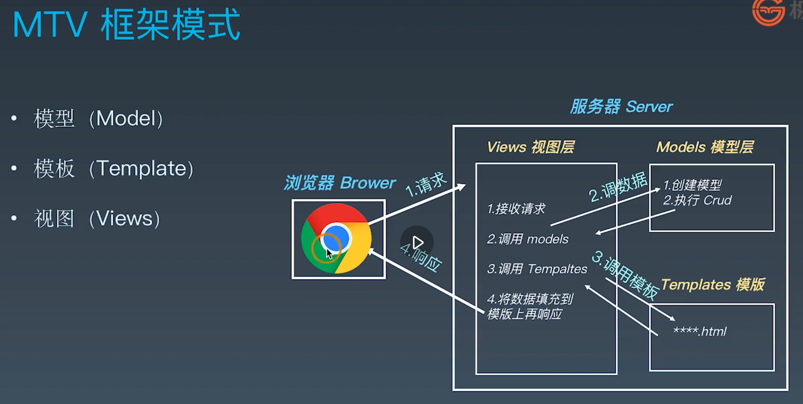
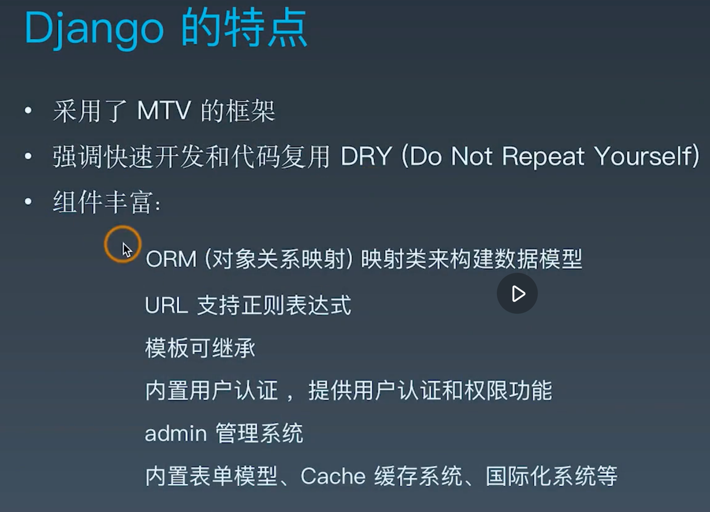
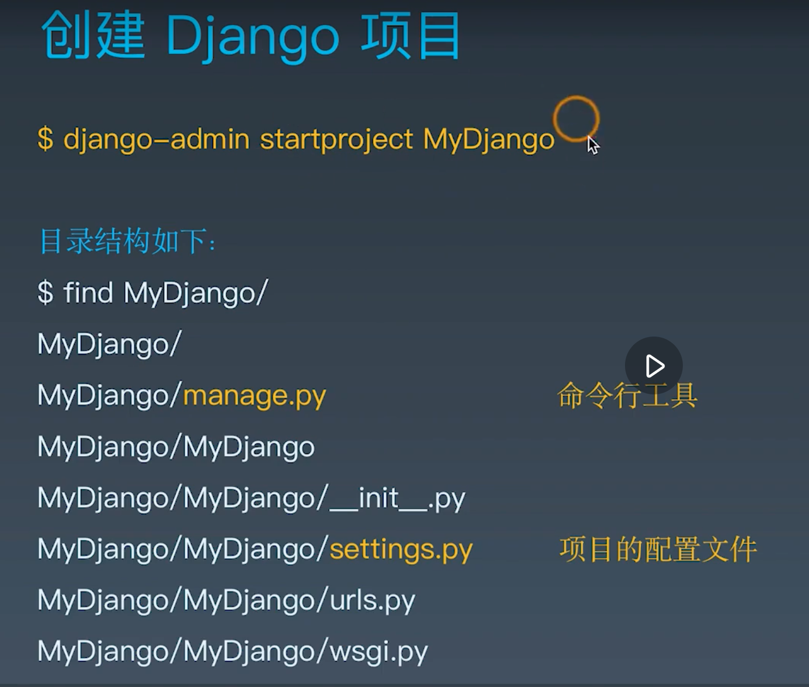
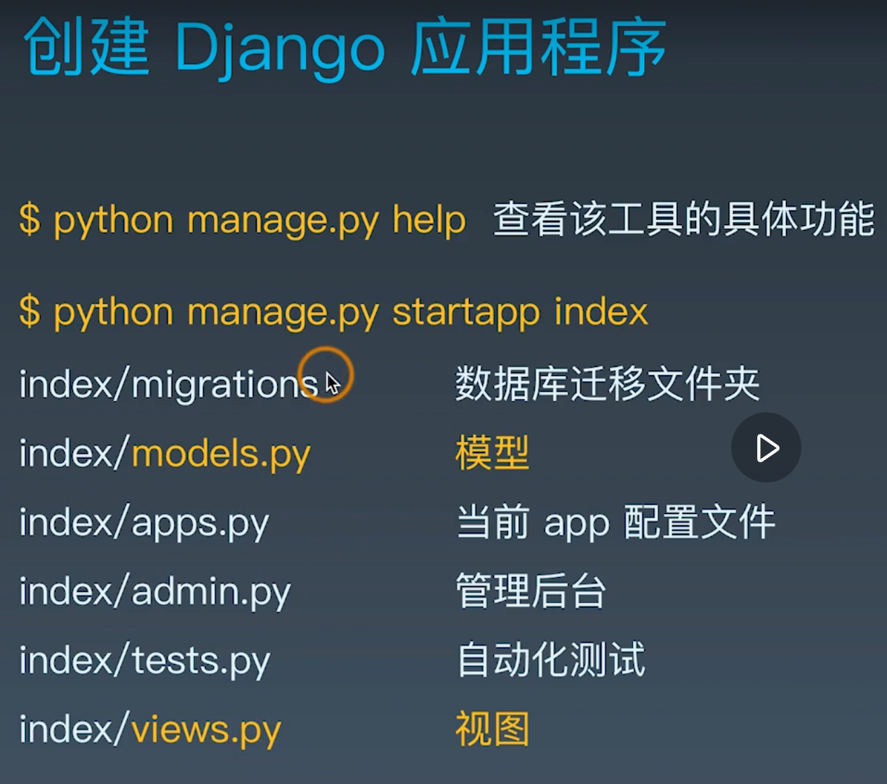
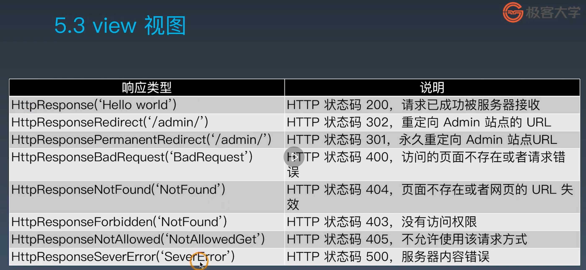
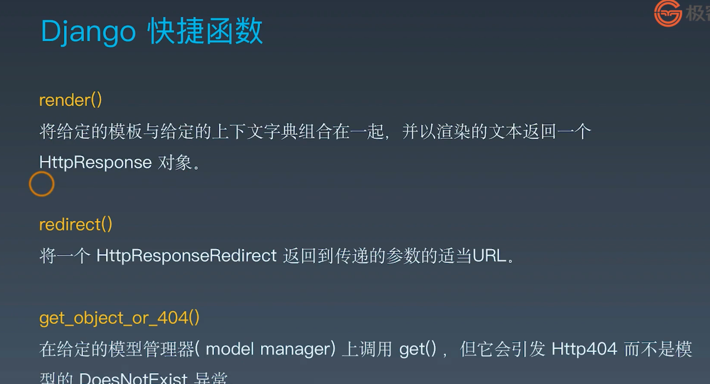
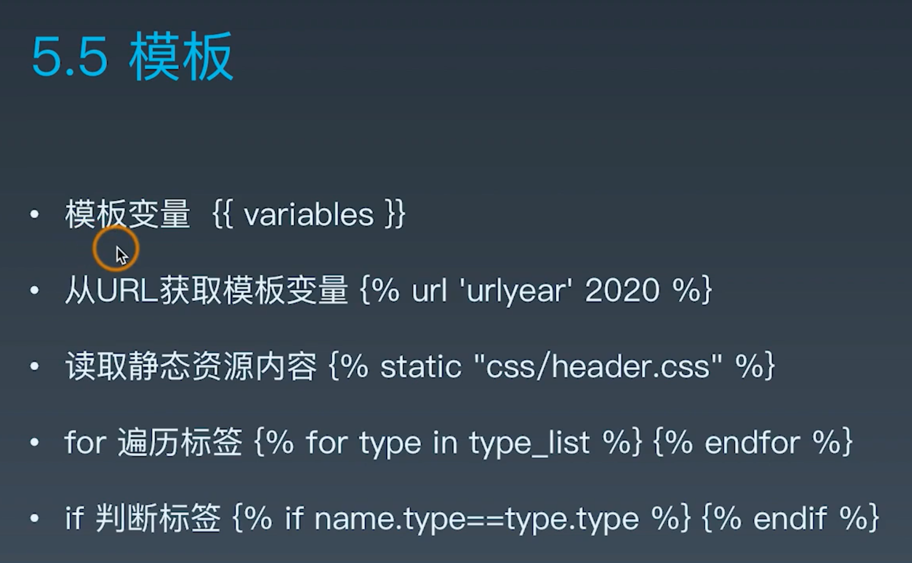

# Python进阶训练营学习笔记
---
## 第六周：Django Web 开发入门
### **本周内容一览：**
#### 1. 开发环境配置
* 设计模式：
  1.MVC
  2.MTV框架模式：
  * Model模式；
  * Template模版
  * Views视图
    
* Django特点：
  
* 推荐实用2.2.13版：
  `pip install --updata django==2.2.13`

* 课程参考资料：
> 获取课程源码操作方法：
切换分支：git checkout 5a
>Django 官方文档
https://docs.djangoproject.com/zh-hans/3.0/

#### 2. 创建项目和目录结构
* 创建Django项目：
  
* 创建DjangoApp：
  
* 启动：
  `python manage.py runserver 127.0.0.1:8001`
* 结束：
  control + c
* 课程参考资料：
>获取课程源码操作方法：
切换分支：git checkout 5a

#### 3.解析settings.py主要配置文件
* `ROOT_URLCONF:'MyDjango.urls'`统一资源定位符的配置文件
* 'BACKEND'：### 定义模版引擎，可改为其它，如：FlaskWeb框架的jinja2
* 主要修改位置：
  1. INSTALLED_APP:  添加app名称；
  2. DATABASES: 设置mysql数据库：

          # export PATH=$PATH:/usr/local/mysql/bin
          # OSError: mysql_config not found
          # pip install mysqlclient
          # pip install pymysql
          DATABASES = {
              'default': {
                  'ENGINE': 'django.db.backends.mysql',
                  'NAME': 'test',
                  'USER': 'root',
                  'PASSWORD': 'rootroot',
                  'HOST': '127.0.0.1',
                  'PORT': '3306',
              }
              # 生产环境有可能连接第二个数据库
              # 'db2': {
              #     'ENGINE': 'django.db.backends.mysql',
              #     'NAME': 'mydatabase',
              #     'USER': 'mydatabaseuser',
              #     'PASSWORD': 'mypassword',
              #     'HOST': '127.0.0.1',
              #     'PORT': '3307',
              # }
          }
* INSTALLED_APP：
  
      INSTALLED_APPS = [
        ### 内置的后台管理系统：
        'django.contrib.admin',
        ### 内置的用户认证系统：
        'django.contrib.auth',
        ### 所有model元数据：
        'django.contrib.contenttypes',
        ### 会话，表示当前访问网站的用户身份：
        'django.contrib.sessions',
        ### 消息提示：
        'django.contrib.messages',
        ### 静态资源的路径：
        'django.contrib.staticfiles',
        ### 注册自己的APP（需要手动配置，否则不工作）：
        'index',
      ]
* 课程参考资料：
>获取课程源码操作方法：
切换分支：git checkout 5a

#### 4. urls调度器
* urls调度流程：
  项目的urls.py -> 找到urlpatterns列表 -> 对应具体views或利用include()在APP中寻找 -> 在APP包下面的urls.py继续重复上面的步骤
  项目的urls.py:

      from django.contrib import admin
      from django.urls import path, include
      urlpatterns = [
        path('admin/', admin.site.urls),
        path('', include('index.urls')),  # index是APP，已在settings.py的installed_app中添加
      ]
  App包下的urls.py:

      from django.urls import path
      from . import views
      urlpatterns = [
          path('', views.index)
      ]
  App包下的inews.py:

      from django.shortcuts import render
      # Create your views here.
      from django.http import HttpResponse
      def index(request):
        return HttpResponse('Hello World!')

* 课程参考资料：
>获取课程源码操作方法：
切换分支：git checkout 5a

#### 5. 模块和包
* 模块：.py文件；
* 包：文件夹，初始化文件：__init__.py;
* 相对调用：
  
      from . import Model1
      from .Pkg2 import M1
      if __name__ == '__main__':
          Model1.func1()

* 课程参考资料：
>获取课程源码操作方法：
切换分支：git checkout 5a

#### 6. 让URL支持变量
* 带变量带URL：

      urlpatterns = [
          path('', views.index),
          ### 带变量的URL
          path('<int:year>', views.year), # 只接收整数，其他类型返回404
          path('<int:year>/<str:name>', views.name),
      ]
* 相应都处理视图：

      # path('<int:year>', views.year), 
      def year(request, year):  #request为固定写法
          return HttpResponse(year)

      # path('<int:year>/<str:name>', views.name),
      def name(requset, **kwargs):  ##多参数处理
          return HttpResponse(kwargs['name'])

* 课程参考资料：
>获取课程源码操作方法：
切换分支：git checkout 5b

#### 7. URL正则和自定义过滤器:
* 正则匹配:
    urls.py:
    `from django.urls import path, re_path`
    `re_path('(?P<year>[0-9]{4}).html', views.myyear, name='urlyear')`
    views.py:

      # re_path('(?P<year>[0-9]{4}).html', views.myyear, name='urlyear'),
      def myyear(request, year):
        return render(request, 'yearview.html')
* 自定义过滤器
  1. 编写自己的过滤器：（converters.py,放于与urls.py相同的文件夹内,满足固定写法)
   
          class IntConverter:
              regex = '[0-9]+'

              def to_python(self, value):
                  return int(value)

              def to_url(self, value):
                  return str(value)

          class FourDigitYearConverter:
              regex = '[0-9]{4}'

              def to_python(self, value):
                  return int(value)

              def to_url(self, value):
                  return '%04d' % value
  2. 注册与实用自定义过滤器：
  
          from django.urls import path, re_path, register_converter
          from . import views, converters #记得导入
          register_converter(converters.IntConverter,'myint')
          register_converter(converters.FourDigitYearConverter, 'yyyy')
          urlpatterns = [
              ### 自定义过滤器
              path('<yyyy:year>', views.year), 
          ]
* 课程参考资料：
>获取课程源码操作方法：
切换分支：git checkout 5b

#### 8. view视图快捷方式
* views视图的响应类型：
   
* view视图快捷方式:
   
* views的常用快捷方式：
  1. render：views与模版的绑定

          def myyear(request, year):
              return render(request, 'yearview.html') ##request需要有，'yearview.html'是在APP文件夹里的templates里的文件，需要自己创建，并注意在settings中设置TEMPLATES = [ ...'APP_DIRS': True,]才能生效。
  2. redirect：跳转

          def year(request, year):
              # return HttpResponse(year)
              return redirect('/2020.html')  ##注意“/”不能漏写，并且没有request
* 课程参考资料：
>获取课程源码操作方法：
切换分支：git checkout 5b

#### 9. 使用ORM创建数据表

* ORM:(在APP文件夹的models.py)
  
        from django.db import models
        # Create your models here.
        # 图书or电影
        class Type(models.Model):
            # id = models.AutoField(primary_key=True) # Django会自动创建,并设置为主键
            typename = models.CharField(max_length=20)
        # 作品名称和作者(主演)
        class Name(models.Model):
            # id 自动创建
            name = models.CharField(max_length=50)
            author = models.CharField(max_length=50)
            stars = models.CharField(max_length=10)
* 完成models.py后，需要用命令行运行：
  `python manage.py makemigrations`:生成migrations
  `python manage.py migrate`:运行migrate，链接数据库, 作用于数据库。

* 数据库设置：
  0. settings设置，和预先建好数据库：

      DATABASES = {
          'default': {
              'ENGINE': 'django.db.backends.mysql',
              'NAME': 'django_db',
              'USER': 'root',
              'PASSWORD': '1234',
              'HOST': '127.0.0.1',
              'PORT': '3306',
          }
      }
  1. **项目文件夹下的__init__.py:**

      import pymysql
      pymysql.install_as_MySQLdb()
  2. 可能出现错误_1：
  
          File "/Users/yannlee/anaconda3/lib/python3.7/site-packages/django/db/backends/mysql/base.py", line 36, in <module>
              raise ImproperlyConfigured('mysqlclient 1.3.13 or newer is required; you have %s.' % Database.__version__)
    >进入：/Users/yannlee/anaconda3/lib/python3.7/site-packages/django/db/backends/mysql/base.py，注释代码段：raise ImproperlyConfigured('mysqlclient 1.3.13 or newer is required; you have %s.' % Database.__version__)
    **原因**：Django中用了pymysql代替MySQLdb，出现版本的误判。

  3. 可能出现错误_2:
   
          AttributeError: 'str' object has no attribute 'decode':
   >找到：  File "/Users/yannlee/anaconda3/lib/python3.7/site-packages/django/db/backends/mysql/operations.py", line 146, in last_executed_query：
    注释代码： query = query.decode(errors='replace')
  **原因**：旧版的python需要decode的转换，现在的python已经不需要了。

* 课程参考资料：
>获取课程源码操作方法：
切换分支：git checkout 5c

#### 10. ORM API
* 数据表的读写 

      $ python manage.py  shell
      >>> from index.models import *
      >>> n = Name()
      >>> n.name='红楼梦'
      >>> n.author='曹雪芹'
      >>> n.stars=9.6
      >>> n.save()

* 使用ORM框架api实现

      增
      >>> from index.models import *
      >>> Name.objects.create(name='红楼梦', author='曹雪芹', stars='9.6')
      >>> Name.objects.create(name='活着', author='余华', stars='9.4')

      查
      >>> Name.objects.get(id=2).name

      改
      >>> Name.objects.filter(name='红楼梦').update(name='石头记')

      删 
      单条数据
      >>> Name.objects.filter(name='红楼梦').delete()
      全部数据
      >>> Name.objects.all().delete()

      其他常用查询
      >>> Name.objects.create(name='红楼梦', author='曹雪芹', stars='9.6')
      >>> Name.objects.create(name='活着', author='余华', stars='9.4')
      >>> Name.objects.all()[0].name
      >>> n = Name.objects.all()
      >>> n[0].name
      >>> n[1].name

      >>> Name.objects.values_list('name')
      <QuerySet [('红楼梦',), ('活着',)]>
      >>> Name.objects.values_list('name')[0]
      ('红楼梦’,)
      filter支持更多查询条件
      filter(name=xxx, id=yyy)

      可以引入python的函数
      >>> Name.objects.values_list('name').count()
      2

* 课程参考资料：
>获取课程源码操作方法：
切换分支：git checkout 5c

#### 11. Django模板开发
* 常用语句：
  
* 从URL获取模版变量：

      #templates：
      
<a href="">2020 booklist</a>

      #urls.py:
      re_path('(?P<year>[0-9]{4}).html', views.myyear, name='urlyear')##中的'urlyear'指的是"()"内的部分
      #作用：把2020传入urlyear,从而调用re_path()

* 课程参考资料：
>获取课程源码操作方法：
切换分支：git checkout 5d

#### 12. 展示数据库中的内容
* locals():
  python内置函数，获取本地所以变量

* 展示数据库中的内容流程：
  urls.py :`path('books', views.books),`
  -> views.py: 

      from .models import Name
      def books(request):
          ###  从models取数据传给template  ###
          n = Name.objects.all()
          return render(request, 'bookslist.html', locals()) ##locals()不能改成n
  **locals()不能改成n**
  -> bookslist.html:

      <html>
          <head>
              <meta charset="UTF-8">
              <title>BooksList</title>
          </head>
          <body>
              
              
bookname: {{book.name}} 
                  author: {{book.author}} 
                  stars: {{book.stars}}
              

              
          </body>
      </html>
  **勿漏**
* 课程参考资料：
>获取课程源码操作方法：
切换分支：git checkout 5d

#### 13. 豆瓣页面展示功能的需求分析

* 课程参考资料：
>获取课程源码操作方法：
切换分支：git checkout 5e

#### 14. urlconf与models 配置
* 多个功能页面最好分成多个APP：

      urlpatterns = [
          path('admin/', admin.site.urls),
          path('',include('index.urls')), #‘’表示空或任意字符
          path('',include('Douban.urls')), #‘’表示空或任意字符
      ]
* mysql反向到ORM:
  输出重定向（把输出定向到文件）python manage.py inspectdb > ./Douban/models.py

      from django.db import models
      class Books(models.Model):
          index = models.BigIntegerField(blank=True, null=True)
          n_star = models.BigIntegerField(blank=True, null=True)
          short = models.TextField(blank=True, null=True)
          sentiment = models.FloatField(blank=True, null=True)

          class Meta:  #元数据，不属于任何字段
              managed = False  #False表示：不能通过ORM修改或删除表到数据库，避免数据冲突。
              db_table = 'books' #原数据库的表名就是books。
   **managed = False  #False表示：不能通过ORM修改或删除表到数据库，避免数据冲突。**
   **当自己创建models时（如index.models），是没有meta数据的，此时默认是True，即可以通过ORM修改数据库。**
* 课程参考资料：
>获取课程源码操作方法：
切换分支：git checkout 5e

#### 15. views视图的编写
* 管理器的操作和模型的操作，可以通过Django文档的QuerySet查询帮助：
  managers只能通过类名获得，不能通过模型的实例获得，如：Books.objects
  shorts = T1.objects.all()返回的是uerySet对象
* 聚合功能，在模型的高级功能里:
  `from django.db.models import Avg`
  `star_avg =f" {T1.objects.aggregate(Avg('n_star'))['n_star__avg']:0.1f} "`
* 常用：
  
      from django.shortcuts import render
      # Create your views here.
      from .models import T1
      from django.db.models import Avg
      def books_short(request):
          ###  从models取数据传给template  ###
          shorts = T1.objects.all()
          # 评论数量
          counter = T1.objects.all().count()
          # 平均星级
          # star_value = T1.objects.values('n_star')
          star_avg =f" {T1.objects.aggregate(Avg('n_star'))['n_star__avg']:0.1f} "
          # 情感倾向
          sent_avg =f" {T1.objects.aggregate(Avg('sentiment'))['sentiment__avg']:0.2f} "
          # 正向数量
          queryset = T1.objects.values('sentiment')
          condtions = {'sentiment__gte': 0.5}   ##大于等于
          plus = queryset.filter(**condtions).count()
          # 负向数量
          queryset = T1.objects.values('sentiment')
          condtions = {'sentiment__lt': 0.5}  ##小于
          minus = queryset.filter(**condtions).count()
          # return render(request, 'douban.html', locals())
          return render(request, 'result.html', locals())
  **注意queryset.filter的写法**

* 课程参考资料：
>获取课程源码操作方法：
切换分支：git checkout 5e

#### 16.结合bootstrap模板进行开发
* bootstrap:
* template中的一些写法：
  1. 继承：``；
  2. 引用：
  
        
      <link rel="stylesheet" href="">
  3. 覆盖和保留：
  
      
        {{ super() }}   ##保留父类的block，否则覆盖。
        <link rel="stylesheet" href="{{ url_for('static', filename='css/timeline.css') }}">
        <link rel="stylesheet" href="{{ url_for('static', filename='css/morris.css') }}">
       
* 课程参考资料：
>获取课程源码操作方法：
切换分支：git checkout 5e

#### 17. 如何阅读Django的源代码:
* __name__:
  随着运行环境的变化而变化，
  python ***.py时，__name__为__main__;
  import ***时， __name__为*
* 课程参考资料：
>获取课程源码操作方法：
切换分支：git checkout 5e

#### 18. manage.py源码分析

* 课程参考资料：
>获取课程源码操作方法：
切换分支：git checkout 5e

#### 疑问：
1. 第5课模块和包：出现错误：ImportError: attempted relative import with no known parent package原因是什么？
2. Django中的settings.py的数据库设置出现错误：NameError: name '_mysql' is not defined的原因？--
   ---  
    **项目文件夹下的__init__.py:**

      import pymysql
      pymysql.install_as_MySQLdb()

      
3. 第8课templates中的yearview.html中的
<a href="">2020 booklist</a>
意思是什么？
4. mysql中的修改字段名和类型等？

#### 加强：
1. html；
2. bootstrap的使用；
3. models的使用。
### **学习心得：**
&emsp;&emsp; 本周的课程内容丰富，完成课程的学习用了大部分时间，剩下最后一天完成作业，课程内容还需要进一步消化，作业也要完善。

学员：李志源

2020年8月2日

